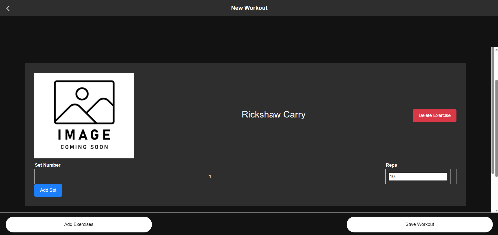
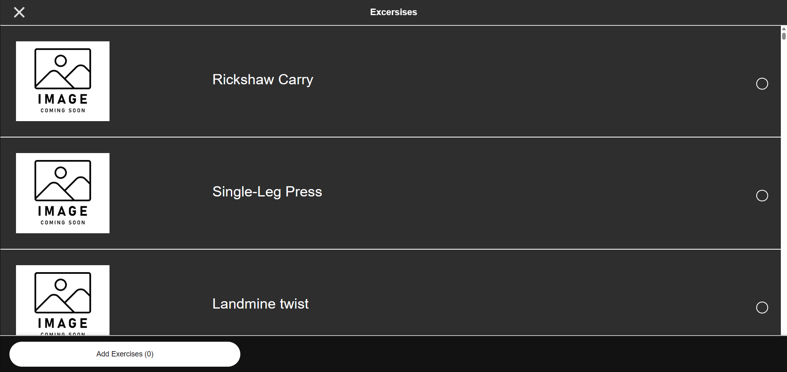
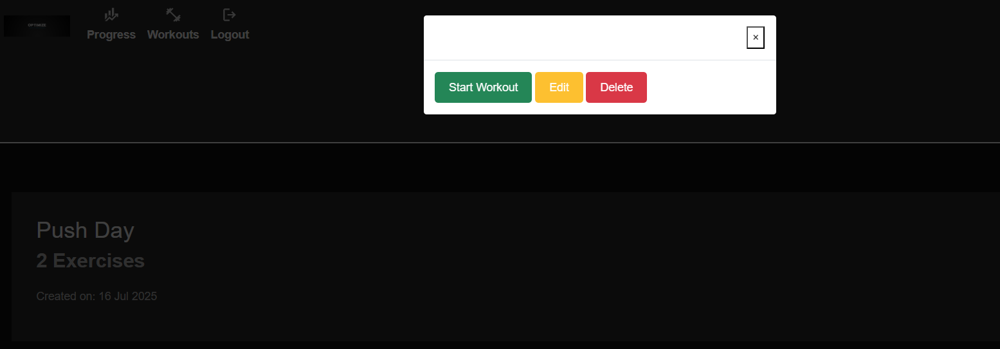
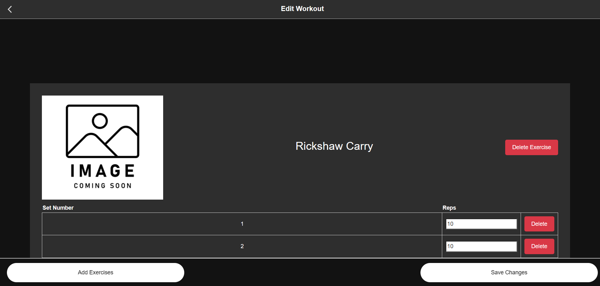
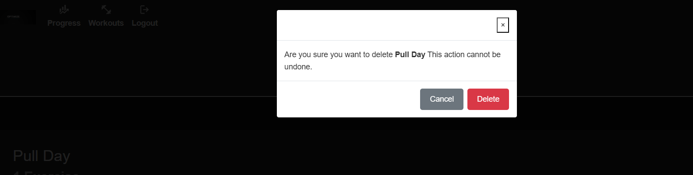

# Optimize

[Source code can be found here](https://github.com/CARRIXK/optimize)

[The live project can be viewed here](https://optimize-800f80d21807.herokuapp.com/)

Optimize is a web-based fitness app that allows users to create and edit workouts tailored to their needs. Users can build personalized workout routines by adding exercises and specifying sets with reps for each. Whether you're tracking strength progress, designing structured training plans, or simply organizing your workouts, Optimize provides a streamlined and intuitive interface to make workout planning effortless.

Features
--------

### Existing Features

- Navigation Bar

  - Featured on Progress, Workouts, login and register sections, the full responsive navigation bar includes links to the progress, Workouts and logout and login (when user in not logged in).  
  - This section will allow the user to easily navigate from through the main areas of the app

  

  

- Register

This page will allow the user to get signed up to Love Running to start their running journey with the community. The user will be able specify if they would like to take part in road, trail or both types of running. The user will be asked to submit their full name and email address.

- Login

The club ethos section will allow the user to see the benefits of joining the Love Running meetups, as well as the benefits of running overall.
This user will see the value of signing up for the Love Running meetups. This should encourage the user to consider running as their form of exercise.
Club Ethos

- Log out

- Progress

This section will allow the user to see exactly when the meetups will happen, where they will be located and how long the run will be in kilometers.
This section will be updated as these times change to keep the user up to date.
Meetup Times

- Workouts

- New Workout

- Edit workout

- Delete Workout

- Footer

The footer section includes links to the relevant social media sites for Love Running. The links will open to a new tab to allow easy navigation for the user.
The footer is valuable to the user as it encourages them to keep connected via social media

- Features Left to Implement

- Search excersise functionality

- Filter excersises by body part

- Start workout

The Start Workout feature will allow users to select a saved workout from the My Workouts section and actively log their progress in real time. Users will be able to:

  - View each exercise in the selected workout.

  - Record the number of sets, reps, and weight used for each exercise.

  - Track the total duration of the workout, which will automatically be recorded when the workout begins and ends.

This feature is designed to help users track performance over time and stay accountable by logging detailed workout data.

- Progress Tracking

Once a workout is completed, the results are automatically reflected in the Progress section of the app. This section provides users with a quick overview of their training habits and milestones through the following metrics:

- Workouts This Week – A bar chart showing workout activity across the current week (Monday to Sunday).

 - Total Workouts – Displays the cumulative number of completed workouts.

 - Longest Streak – Highlights the longest number of consecutive workout days.

 - Most Active Day – Indicates the day of the week the user is most consistently active.

Additionally, users can tap the calendar icon in the top-right corner to view their full workout history, including past workout sessions and performance logs.

# Testing

-----

This page will allow the user to get signed up to Love Running to start their running journey with the community. The user will be able specify if they would like to take part in road, trail or both types of running. The user will be asked to submit their full name and email address.

In addition, you should mention in this section how your project looks and works on different browsers and screen sizes.

You should also mention in this section any interesting bugs or problems you discovered during your testing, even if you haven't addressed them yet.

If this section grows too long, you may want to split it off into a separate file and link to it from here.

**Validator Testing**

- HTML

Each page was run locally on a server and then the HTML from the page source was passed through the  [Official WC3 validator](https://validator.w3.org/#validate_by_input)

- [x] Login Page
- [x] Logout page
- [] Forgot password
- [x] Progress

- [] Workouts
- [x] New Workout
- [x] Add Excersises to new workout
- [x] Workout set reps
- [x] Edit Workout 

Errors found:

  - This is when a new workout is added to the 'My Workouts section'
  - Error: Attribute workout_id not allowed on element button at this point.
  - Error: Attribute workout_title not allowed on element button at this point.

- CSS
No errors were found when passing through the 
[Official W3C (Jigsaw) validator](https://jigsaw.w3.org/css-validator/#validate_by_input)

**Unfixed Bugs**
You will need to mention unfixed bugs and why they were not fixed. This section should include shortcomings of the frameworks or technologies used. Although time can be a big variable to consider, paucity of time and difficulty understanding implementation is not a valid reason to leave bugs unfixed.

- The forgot password functionality throws the following error: [WinError 10061] No connection could be made because the target machine actively refused it
- When adding excersises to new workout the app crashes. This could be down to improper assignment of workout id. 

# Deployment
-------
This section should describe the process you went through to deploy the project to a hosting platform (e.g. GitHub)

The site was deployed to GitHub pages. The steps to deploy are as follows:
In the GitHub repository, navigate to the Settings tab
From the source section drop-down menu, select the Master Branch
Once the master branch has been selected, the page will be automatically refreshed with a detailed ribbon display to indicate the successful deployment.
The live link can be found here - https://code-institute-org.github.io/love-running-2.0/index.html

# Credits
--------
In this section you need to reference where you got your content, media and extra help from. It is common practice to use code from other repositories and tutorials, however, it is important to be very specific about these sources to avoid plagiarism.

You can break the credits section up into Content and Media, depending on what you have included in your project.

Content
The text for the Home page was taken from Wikipedia Article A
Instructions on how to implement form validation on the Sign Up page was taken from Specific YouTube Tutorial
The icons in the footer were taken from Font Awesome
Media
The photos used on the home and sign up page are from This Open Source site
The images used for the gallery page were taken from this other open source site
Congratulations on completing your Readme, you have made another big stride in the direction of being a developer!

Other General Project Advice
Below you will find a couple of extra tips that may be helpful when completing your project. Remember that each of these projects will become part of your final portfolio so it’s important to allow enough time to showcase your best work!

One of the most basic elements of keeping a healthy commit history is with the commit message. When getting started with your project, read through this article by Chris Beams on How to Write a Git Commit Message

Make sure to keep the messages in the imperative mood
When naming the files in your project directory, make sure to consider meaningful naming of files, point to specific names and sections of content.

For example, instead of naming an image used ‘image1.png’ consider naming it ‘landing_page_img.png’. This will ensure that there are clear file paths kept.
Do some extra research on good and bad coding practices, there are a handful of useful articles to read, consider reviewing the following list when getting started:

Writing Your Best Code
HTML & CSS Coding Best Practices
Google HTML/CSS Style Guide
Getting started with your Portfolio Projects can be daunting, planning your project can make it a lot easier to tackle, take small steps to reach the final outcome and enjoy the process!

# Links to content
---
## Links to content
- [Features](#features)
- [User Experience](#user-experience)
- [Design](#design)
- [Fonts](#fonts)
- [Colour](#colour)
- [Wireframes](#wireframes)
- [Development Process](#development-process)
  - [Project Planning](#project-planning)
  - [Inline JavaScript](#inline-javascript)
  - [Data Model](#data-model)
- [Testing](#testing)
  - [Manual Testing](#manual-testing)
  - [Feature Testing](#feature-testing)
  - [Responsiveness](#responsiveness)
  - [Browser Compatibility](#browser-compatibility)
  - [Lighthouse](#lighthouse)
  - [Code Validation](#code-validation)
  - [Python](#python)
  - [JavaScript](#javascript)
  - [HTML](#html)
  - [CSS](#css)
  - [User Stories](#user-stories)
  - [Automated Testing](#automated-testing)
  - [Django Testing](#django-testing)
  - [Selenium Testing](#selenium-testing)
  - [Bugs](#bugs)
- [Libraries and Programs Used](#libraries-and-programs-used)
- [Deployment](#deployment)
  - [Deploying the App on Heroku](#deploying-the-app-on-heroku)
  - [Making a Local Clone](#making-a-local-clone)
  - [Running the App in Your Local Environment](#running-the-app-in-your-local-environment)
- [Credits](#credits)
- [Acknowledgements](#acknowledgements)

# Features
* Dashboard : After logging in, users are directed to the Dashboard Page, which provides an overview of their most recent activities and workouts. The main purpose of this page is to give users quick access to their recent progress and a streamlined way to track their fitness journey.

* Workouts : The Workouts page is where users can view a list of all the workouts they have created, providing an organized way to manage their fitness routines. Each workout is displayed with its title, number of excersises in that workout and date it was created. Users can interact with any workout by pressing the options button next to it, which opens a modal offering several options: starting the workout, editing the workout, or deleting it. 

* Create Workout : Creating a workout on the platform is an easy, customizable process that allows users to design routines tailored to their goals. Users begin by providing a title for their workout, such as "Leg Day" or "Upper Body Strength," then select exercises from a pre-defined list, which includes various movements targeting different muscle groups. After selecting exercises, users add sets and reps for each, determining the number of sets and reps per set. Users can then review and adjust the exercises, sets, and reps before saving the workout to their profile for future use. This process empowers users to create highly personalized workouts, track their progress, and stay on top of their fitness goals.

* Edit Workout: Editing a workout allows users to customize and adjust their exercises to better suit their needs. After selecting a workout to edit, users can add or remove exercises from the workout by selecting exercises from the list or deleting unwanted ones. For each exercise, users can add sets, specifying the number of repetitions . Additionally, if a user adds a new exercise, they can immediately add sets to it, ensuring that the workout is tailored to their specific training goals. .

* Future Features: In the future, functionality for starting a workout will be added to allow users to track their progress during the workout. This feature will enable users to begin their workout session directly from the workouts page, marking the start of their training. Once a workout is started, the app will track the completion of each exercise and set, recording important data such as the number of reps performed, the weight lifted, and any other relevant metrics. This tracking will provide users with real-time feedback on their performance, helping them to monitor their progress and adjust their workout intensity as needed. Additionally, the app will save these workout sessions, allowing users to review past workouts, track improvements over time, and make informed decisions about their future training routines.

# User Experience
## Design

### Fonts

### Colour

### Wireframes

# Development Process

# Data Model

# Testing
* Manual testing
* Automated testing
* In-app testing
* User story testing
* Validator testing

## Manual Testing
**Feature Testing**

**Responsiveness**
Here's screenshots taken with the Chrome dev tools device toolbar, set to the iPhone 12 Pro. They are, in order, the Workouts page, Create workout page, Add excersises page, workout set reps page:

iphone12_homepage iphone12_editor iphone12_instrument iphone12_review surfacepro_loop_detail

Here's the same five pages on the Surface Pro 7:

And finally the same five pages on a desktop monitor (1920x1080): 

**Browser Compatibility**
| Feature                                      | Chrome | Firefox | Safari (mobile) |
|----------------------------------------------|--------|---------|-----------------|
| Audio playback upon first user interaction  |    |     |             |
| Fonts render correctly                       |    |     |             |
| All elements visible                         |    |     |             |
| Pages are responsive at all screen sizes     |   |     |             |

### Lighthouse
Here are the lighthouse reports for the site's main pages :

**Workouts**

**Create workouts**

**Add Excersises**

**Edit workouts**

### Code Validation

**Python code** :

* Python code is yet to be validated by both the Flake8 linter (installed in VSCode) and the external CodeInstitute validator @ https://pep8ci.herokuapp.com/.

**JavaScript code** :

**HTML Validation** :

**CSS Validation** :

**User Stories**

## Automated Testing

**Testing django views, models and forms.**
 

# Bugs

Return to top

# Libraries and Programs Used

* Heroku
* Heroku was used to deploy the project
* Git
* Version control was implemented using Git through the Github terminal.
* Github
* Github was used to store the projects after being pushed from Git and its cloud service Github Pages was used to serve the project on the web. GitHub Projects was used to track the User Stories.
* Visual Studio Code

# Credits

# Acknowledgements

