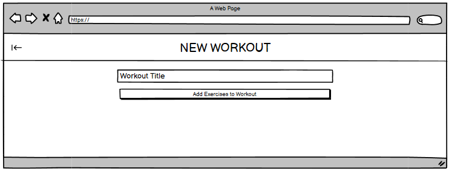
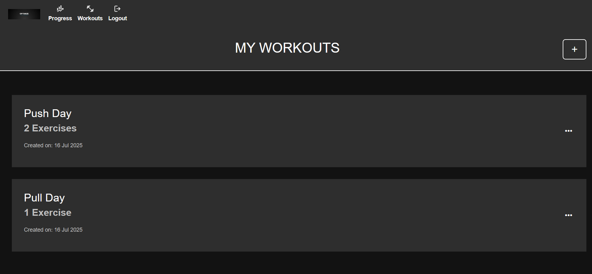
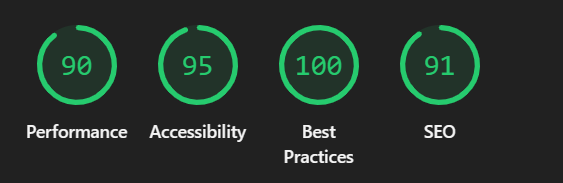

# Optimize

[Source code can be found here](https://github.com/CARRIXK/optimize)

[The live project can be viewed here](https://optimize-800f80d21807.herokuapp.com/)

Optimize is a web-based fitness app that allows users to create and edit workouts tailored to their needs. Users can build personalized workout routines by adding exercises and specifying sets with reps for each. Whether you're tracking strength progress, designing structured training plans, or simply organizing your workouts, Optimize provides a streamlined and intuitive interface to make workout planning effortless.

# Table of Contents
- [UX Design Process](#ux-design-process)
  - [Wireframes](#wireframes)
  - [Site Map Diagram](#site-map-diagram)
  - [Visual Design: Colour Scheme and Typography](#visual-design-colour-scheme-and-typography)
- [Features](#features)
  - [Navigation Bar](#navigation-bar)
  - [Register](#register)
  - [Login](#login)
  - [Log out](#log-out)
  - [Progress](#progress)
  - [Workouts Page](#workouts-page)
  - [New Workout](#new-workout)
  - [Edit workout](#edit-workout)
  - [Delete Workout](#delete-workout)
  - [Footer](#footer)
  - [Features Left to Implement](#features-left-to-implement)
- [Project Planning](#project-planning)
- [Testing](#testing)
  - [Manual Testing](#manual-testing)
  - [Responsivity Testing](#responsivity-testing)
  - [Automated Testing](#automated-testing)
  - [Validator Testing](#validator-testing)
  - [Lighthouse Tests](#lighthouse-tests)
  - [Unfixed Bugs and Responsivity Issues](#unfixed-bugs-and-responsivity-issues)
  - [Summary of Testing Results](#summary-of-testing-results)
- [Deployment](#deployment)
- [Credits](#credits)
  - [Libraries and Programs Used](#libraries-and-programs-used)

# UX Design Process

-----

## Wireframes

As part of the Develop stage of the XU Design Process, I created wireframes to visualize the layout and structure of the fitness app before starting development. Using Balsamiq, I was able to quickly create low-fidelity mockups that focused on usability, navigation, and content placement. These wireframes served as a blueprint for the final design and ensured a clear user journey

**Login Wireframe**

**Register WireFrame**

**Logout Wireframe**

**Progress Wireframe**

**Workouts Wireframe**

**New Workout Step 1**

**New Workout Step 2**

**New Workout Step 3**

**Workout Options Modal Wireframe**

**Edit Workout Wireframe**

**Add Excersises to Edit Workout Wireframe**

**Delete Workout Comfirmation Modal**

## Site Map Diagram

## Visual Design: Colour Scheme and Typography

### Colours  
The site uses a dark-themed colour palette for a sleek and modern aesthetic. This choice was made to create a visually calming environment, reduce eye strain in low-light settings, and enhance focus on content. The following CSS variables define the primary colour scheme:

- `--primary-colour: #121212` – Serves as the main background. The deep black tone improves contrast and reduces visual fatigue during prolonged usage.
- `--secondary-colour: #2E2E2E` – Used on containers such as cards and section blocks to subtly separate content layers without being jarring.
- `--highlight-colour: #00bbff` – Chosen for its vibrant yet non-aggressive tone. It’s used for links, buttons, and hover states to guide user attention and support intuitive navigation.
- `--description: #BFBFBF` – A soft grey tone used for secondary text such as descriptions and helper text, helping to create a clear visual hierarchy without diminishing readability.
- `--text-white: #FFFFFF` – The default text colour against the dark background, ensuring sharp, readable contrast across all content areas.

This colour scheme helps establish a consistent, modern design language that aligns with common accessibility practices and improves user experience on both desktop and mobile.

### Typography  
- **Font used throughout the site**: `'Inter', sans-serif`

Inter was deliberately chosen for its high legibility, especially on digital interfaces. The font's clean lines and open letterforms enhance the readability of headings and body text alike. 

Using a single font family simplifies the design and keeps the visual experience cohesive. This also ensures optimal rendering on various screen sizes and devices. 

By pairing a modern typeface with high-contrast colours, the design supports clear content delivery and strengthens usability across the site.

# Features
--------

## Navigation Bar

  - Featured on Progress, Workouts, login and register sections, the full responsive navigation bar includes links to the progress, Workouts and logout and login (when user in not logged in).  
  - This section will allow the user to easily navigate from through the main areas of the app

  

  

## Register

Users can easily create an account by filling out a simple registration form. During the sign-up process, they are required to provide:

- Username

- Email address

- Password

This information is securely handled and stored, allowing users to log in and access personalized features within the app. The registration process is user-friendly and ensures only authenticated users can track and manage their workouts.

## Login

Registered users can log in by entering their username and password on the login page. If a user hasn’t signed up yet, they can easily navigate to the registration page via a clearly visible link.

Features of the login page include:

- Username and password authentication

- Redirect link to registration if the user doesn't have an account

- Secure login using Django’s built-in authentication system

Once logged in, users are granted access to personalized sections of the app, such as workout tracking and progress metrics.

## Log out

Users can log out of their account by clicking the logout icon in the navigation bar. This action takes them to a confirmation page, where they are asked to confirm whether they want to end their session.

Key points:

- Logout is easily accessible from any page via the nav bar icon

- Users are shown a confirmation message before logging out

- Once confirmed, the user is securely logged out and notified they are no longer logged in with a link to the login page

This helps ensure users don’t accidentally log out and improves overall user experience and security.

## Progress

The Progress section is currently only populated with static dummy data. In future iterayions it will provide users with an overview of their workout activity and habits. It visually displays their performance over time and motivates them to stay consistent.

Key features:

- Workouts This Week (Bar Chart):
A visual graph showing which days (Monday to Sunday) the user has completed workouts. Helps highlight active vs. inactive days.

- Total Workouts:
Displays the cumulative number of workouts completed.

- Longest Streak:
Shows the highest number of consecutive days the user has logged workouts.

- Most Active Day:
Highlights the day of the week the user most frequently works out.

- Workout History:
Users can also click the calendar icon in the top-right to view a detailed log of their previous workouts, including dates and workout details.

This section helps users measure their consistency and identify patterns, supporting long-term fitness goals.

## Workouts Page

On the Workouts page, logged-in users can:

- View a list of workouts they have created.

- Click the plus button to start creating a new workout.

- Press the ⋯ (three dots) button on any workout to view available actions:

  - Start Workout

  - Edit

  - Delete

This page gives users full control over managing their custom workout plans.

## New Workout

1. After a user clicks the plus button on the Workouts page, they are taken to the page shown below. Here, the user is prompted to enter a title for the workout (e.g., "Push Day", "Cardio Routine").

2. After giving the workout a title, users are taken to the Add Exercises page.

- This page displays a scrollable list of exercises, each with a checkbox.

- Users can select multiple exercises to include in their workout.

- The "Add Exercises" button dynamically updates to show the number of exercises selected (e.g., “Add 3 Exercises”), helping users keep track of their selection in real time.

3. After selecting exercises, users are brought to a review page where they can:

- View all selected exercises in a clean, organized layout.

- Add sets and specify the number of reps for each exercise using input fields.

- Delete any exercise they no longer want included in the workout.

- Add more exercises at any time with the "Add Exercises" button which shows a similar display to the previous page.

Breaking the workout creation into three clear steps—naming the workout, selecting exercises from a scrollable list, and reviewing with options to add sets, reps, or modify exercises—provides a smooth and intuitive user experience. This approach prevents overwhelm, keeps the process organized, and allows users to easily build and customize workouts with confidence and efficiency.

## Edit workout

After clicking the "..." button on a workout, a modal appears presenting options including Start Workout, Edit, and Delete. Selecting the Edit button takes the user to a workout editor where they can easily manage their workout by adding new exercises, deleting existing ones, and adjusting the number of sets and reps for each exercise. This streamlined interface allows for quick and flexible customization of workouts.

## Delete Workout

Similarly, clicking the Delete button opens a confirmation modal asking the user to confirm the deletion of the workout. Once confirmed, the workout is permanently removed from the database, ensuring that accidental deletions are prevented while providing a clear and straightforward way to manage workout records.

## Footer

The footer section includes links to the relevant social media sites for Optimize. The links currently do not take the user anywhere as the social media sites have not been set up. The footer shows the business name and dynamically updates the current year automatically for accuracy.

## Features Left to Implement

### **Start Workout**
The **Start Workout** feature allows users to select a saved workout from the **My Workouts** section and actively log their progress in real time. Users can:

- View each exercise in the selected workout.
- Record the number of sets, reps, and weight used for each exercise.
- Track the total duration of the workout, which automatically starts when the workout begins and stops when it ends.

This feature is designed to help users track performance over time and stay accountable by logging detailed workout data.

### **Progress Tracking**
Once a workout is completed, the results are automatically reflected in the **Progress** section of the app. This section provides users with a quick overview of their training habits and milestones through the following metrics:

- **Workouts This Week** – A bar chart showing workout activity across the current week (Monday to Sunday).
- **Total Workouts** – Displays the cumulative number of completed workouts.
- **Longest Streak** – Highlights the longest number of consecutive workout days.
- **Most Active Day** – Indicates the day of the week the user is most consistently active.

Additionally, users can tap the calendar icon in the top-right corner to view their full workout history, including past workout sessions and performance logs.

### **Planned Features**
- Search exercise functionality.
- Filter exercises by body part.
- Make workout creation and update messages more user-friendly (instead of simple message boxes).
- Add actual images for each workout.

---

# Project Planning and Development Process
The project was planned and managed using Agile methodologies, supported by GitHub tools and workflows.

**Planning**:
User stories and tasks were created as GitHub Issues to define requirements clearly. A project board was set up to organize tasks into columns like To Do, In Progress, and Done, helping track progress visually. Milestones marked key phases and releases.

**Development**:
Features and fixes were developed on a separate branch, keeping the main branch stable. Pull requests facilitated code reviews before merging changes. Regular commits with descriptive messages documented progress incrementally.

**Agile Practices**:
Iterative development cycles allowed continuous feedback and improvement. Frequent testing and integration ensured high code quality and adaptability to changing requirements.

This combined planning and development approach improved collaboration, transparency, and the overall quality of the project.

---

# Testing

-----

## Manual Testing

This section documents the manual testing procedures used to validate the functionality, usability, responsiveness, and data management of the Optimize fitness application. Testing was performed manually across all core pages with each feature being tested based on defined expected outcomes.
                 

### Manual Tests Cases - User Authentication

| Test Description | Expected Result | Actual Result |
| --- | --- | --- |
| Registration successful; user added to database | New user is added to database | Worked as expected |
| Register with a username that already exists | Registration fails; error shown and user not added again | Worked as expected |
| Register with empty fields | Registration fails; user sees validation error | Worked as expected |
| Register with a password that’s too short | Registration fails; user sees password validation message | Worked as expected |
| Log in with correct username and password | Login successful; user redirected to progress section | Worked as expected |
| Log in with correct username but incorrect password | Login fails; user sees error message | Worked as expected |
| Log in with non-existent username | Login fails; user gets error message | Worked as expected |
| Attempt login with empty fields | Login fails; user sees validation errors | Worked as expected |
| Log in and remain authenticated across session | User stays logged in when navigating through pages | Worked as expected |
| Log out from account | User is logged out and redirected to login or home page | Worked as expected |

### Manual Tests Cases- Navigation Bar

| Test Description | Expected Result | Actual Result |
| --- | --- | --- |
| Verify that the Login link appears when the user is not logged in | The navigation bar displays a Login link and hides Progress, Workouts, and Logout links | Worked as expected |
| Verify that clicking the Login link redirects to the login page | The browser navigates to the login page (/accounts/login/) | Worked as expected |
| Verify that the Progress, Workouts, and Logout links appear when the user is logged in | The navigation bar displays links to Progress, Workouts, and Logout, and hides the Login link | Worked as expected |
| Verify that clicking the Progress link while logged in navigates to the progress page | The progress page (/progress/) loads successfully | Worked as expected |
| Verify that clicking the Workouts link while logged in navigates to the workouts page | The workouts page (/workouts/) loads successfully | Worked as expected |
| Verify that clicking the Logout link logs the user out | User is logged out and redirected to the homepage or login page, and only the Login link is visible | Worked as expected |
| Verify that navigation bar is consistent across multiple pages | The navigation bar appears with the same layout and links on all pages | Worked as expected |
| Verify that the navigation bar adapts correctly on mobile view (if responsive) | Navigation bar collapses or adjusts layout, and links are accessible via mobile menu | Worked as expected |

### Manual Tests Cases – Progress Page

| Test Description | Expected Result | Actual Result |
| --- | --- | --- |
| Verify that the progress page loads for a logged-in user | Page loads successfully and displays dummy progress data (charts, stats, etc.) | Worked as expected |
| Verify redirection when accessing progress page while logged out | User is redirected to the login page | Worked as expected |
| Verify that the “Workouts This Week” bar chart is visible | Bar chart appears showing static workout data across Monday to Sunday | Worked as expected |
| Verify that the "Total Workouts" stat is displayed | A visible number is shown (e.g., “Total Workouts: 12”) — static value for now | Worked as expected |
| Verify that the "Longest Streak" stat is displayed | Static number is displayed (e.g., “Longest Streak: 4 days”) | Worked as expected |
| Verify that the "Most Active Day" is displayed | A day of the week is shown (e.g., “Most Active Day: Wednesday”) — static value | Worked as expected |
| Verify that the calendar icon appears in the top-right corner | Calendar icon is visible and clickable | Worked as expected |
| Verify that clicking the calendar icon opens workout history view | A modal or new view opens with dummy workout history log (dates + details) | Worked as expected |
| Verify that visual elements are responsive (desktop/mobile) | All graphs, text, and icons adjust properly across screen sizes | Worked as expected |
| Verify navigation works from progress page | Navbar is present and links like Workouts, Logout, etc. function normally | Worked as expected |

### Manual Test Cases – Workouts Page

| Test Description | Expected Result | Actual Result |
| --- | --- | --- |
| Verify that the Workouts page loads for a logged-in user | The page loads successfully and displays a list of user-created workouts | Worked as expected |
| Verify redirection when accessing the Workouts page while logged out | User is redirected to the login page | Worked as expected |
| Verify that the list of workouts is displayed | All workouts created by the user are visible on the page in a readable format | Worked as expected |
| Verify that the plus (+) button is visible | A floating or clearly visible + button appears on the screen for adding a workout | Worked as expected |
| Verify that clicking the plus (+) button redirects to the workout creation page | User is taken to a form/page where they can enter a new workout | Worked as expected |
| Verify that the three dots (⋯) menu appears on each workout card | Each workout entry has a menu or button with ⋯ to open additional actions | Worked as expected |
| Verify that clicking the ⋯ button shows the expected options | Options shown are: Start Workout, Edit, and Delete | Worked as expected |
| Verify that clicking Edit redirects to the edit form for the selected workout | User is taken to a form pre-filled with the workout’s current data | Worked as expected |
| Verify that clicking Delete removes the workout | The workout is removed from the list after confirming on the modal | Worked as expected |
| Verify that deleted workouts no longer appear on page refresh | Refreshing the page does not bring back deleted workouts | Worked as expected |
| Verify responsive layout and interaction on mobile view | Workouts page and buttons are functional and properly laid out on smaller screens | Worked as expected |
| Verify navigation bar works correctly on Workouts page | Nav bar links (e.g., Progress, Logout) are present and functional | Worked as expected |

### Manual Test Cases – New Workout

| Test Description | Expected Result | Actual Result |
| --- | --- | --- |
| User clicks "+" button on the Workouts page | User is navigated to the workout naming page | Worked as expected |
| User enters a title (e.g., “Push Day”) and submits | User is redirected to the exercise selection page with a list of checkboxes | Worked as expected |
| Exercises are displayed in a scrollable list | The user can scroll through the list and check multiple exercises | Worked as expected |
| User can select multiple exercises | The “Add Exercises” button updates dynamically to reflect the number selected (e.g., “Add 3 Exercises”) | Worked as expected |
| User clicks “Add Exercises” | User is taken to the review page displaying the selected exercises | Worked as expected |
| Review page displays all selected exercises with set/rep input fields | Each exercise displays editable fields to input sets and reps | Worked as expected |
| User inputs valid sets and reps (e.g., 3 sets of 12 reps) | Inputs are accepted and retained | Worked as expected |
| User can delete an excersise | Exercise is removed from the workout list | Worked as expected |
| User clicks “Add Exercises” again on review page | User is returned to the exercise list with checkboxes (already-selected exercises can be re-added or updated) | Worked as expected |
| User tries to proceed without entering a workout title | User is shown an error or prevented from moving forward (validation message appears) | Worked as expected |
| After editing workout and saving, return to workouts page | New workout appears in the workouts list with title and assigned exercises | Worked as expected |

### Manual Test Cases – Edit Workout

| Test Description | Expected Result | Actual Result |
| --- | --- | --- |
| User clicks edit workout on workout options modal button on the Workouts page | The slected workout and its excerises are displayed ready to be edited | Worked as expected |
| User enters a title (e.g., “Push Day”) and saves | Edited title persists in database | Worked as expected |
| Exercises are displayed in a scrollable list | The user can scroll through the list and check multiple exercises | Worked as expected |
| User selects multiple exercises | The “Add Exercises” button updates dynamically to reflect the number selected (e.g., “Add 3 Exercises”) | Worked as expected |
| User clicks “Add Exercises” | User is taken back to workout editor with new workouts added to the list | Worked as expected |
| Edit workout page displays all selected exercises with set/rep input fields | Each exercise displays editable fields to input sets and reps | Worked as expected |
| User clicks delete excersise button | Exercise is removed from the workout list | Worked as expected |
| User tries to proceed without entering a workout title | User is shown an error or prevented from moving forward (validation message appears) | Worked as expected |
| After editing workout and saving, return to workouts page | New workout appears in the workouts list with title and assigned exercises | Worked as expected |

### Manual Test cases – Footer

| Test Description | Expected Result | Actual Result |
| --- | --- | --- |
| Check that footer displays the business name "Optimize" | The footer should contain the text "Optimize" | Worked as expected |
| Verify that the current year is displayed dynamically | The footer should automatically display the current year (e.g., "© Optimize 2025") | Worked as expected |
| Test if footer is present and visible on all required pages | Footer should be visible at the bottom of all main pages | Worked as expected |
| Verify that social media icons/links are displayed | Footer should include placeholder icons/links for social media (e.g., Facebook, Instagram, X, LinkedIn) | Worked as expected |
| Check that social media links currently do not navigate anywhere | Clicking any social media icon/link should have no effect (links are inactive/placeholders) | Worked as expected |
| Test responsiveness of footer on mobile devices | Footer content should adjust correctly to smaller screen sizes without overlapping or breaking layout | Worked as expected |

--- 

### Responsivity Testing

To ensure the fitness app delivers a seamless experience across all devices, extensive responsivity testing was conducted. A mobile-first approach was followed, utilizing Chrome Browser DevTools to simulate various screen sizes and devices.

### Viewport Breakpoints Tested 

| Device Type | Width (px) | Height (px) | Notes |
| --- | --- | --- | --- |
| Mobile S (e.g. iPhone 5/SE) | 320 | 568 | Common small phone resolution |
| Mobile M (e.g. iPhone 12) | 375 | 667 | Standard for many modern smartphones |
| Mobile L (e.g. Pixel 2 XL) | 425 | 736 | Larger phone screens |
| Tablet (e.g. iPad Mini) | 768 | 1024 | Typical portrait mode for tablets |
| Laptop (e.g. MacBook 13") | 1024 | 768 | Classic laptop screen size |
| Laptop L (e.g. Desktop HD) | 1440 | 900 | Good for larger laptop displays |

### Navbar  

| Screen Size | Issue Found? | Expected Behaviour | Notes / Fixes Applied |
| --- | --- | --- | --- |
| 320px | no | Hamburger menu should be visible. When clicked it shows nav items stacked | N/A |
| 375px | no | Hamburger menu should be visible. When clicked it shows nav items stacked | N/A |
| 425px | no | Hamburger menu should be visible. When clicked it shows nav items stacked | N/A |
| 768px | no | Hamburger menu should be visible. When clicked it shows nav items stacked | N/A |
| 1024px | no | Nav bar displays logo, register and login nav items | N/A |
| 1440px | no | Nav bar displays logo, register and login nav items | N/A |

### Register Page 

| Screen Size | Issue Found? | Expected Behaviour | Notes / Fixes Applied |
| --- | --- | --- | --- |
| 320px | yes | Hamburger menu should be visible | Content overlaps the navbar and footer |
| 375px | yes | Hamburger menu should be visible | Main content could have more padding at the top and bottom of it |
| 425px | no | Hamburger menu should be visible | N/A |
| 768px | no | Hamburger menu should be visible | N/A |
| 1024px | no | Nav bar displays logo, register and login nav items | N/A |
| 1440px | no | Nav bar displays logo, register and login nav items | N/A |

### Login Page 

| Screen Size | Issue Found? | Expected Behavior | Notes / Fixes Applied |
| --- | --- | --- | --- |
| 320px | no | Hamburger menu should be visible | N/A |
| 375px | no | Hamburger menu should be visible | N/A |
| 425px | no | Hamburger menu should be visible | N/A |
| 768px | no | Hamburger menu should be visible | N/A |
| 1024px | no | Nav bar displays logo, register and login nav items | N/A |
| 1440px | no | Nav bar displays logo, register and login nav items | N/A |

### Logout Page 

| Screen Size | Issue Found? | Expected Behavior | Notes / Fixes Applied |
| --- | --- | --- | --- |
| 320px | no | Hamburger menu should be visible | N/A |
| 375px | no | Hamburger menu should be visible | N/A |
| 425px | no | Hamburger menu should be visible | N/A |
| 768px | no | Hamburger menu should be visible | N/A |
| 1024px | no | Nav bar displays logo, progress, workouts and logout nav items | N/A |
| 1440px | no | Nav bar displays logo, progress, workouts and logout nav items | N/A |

### Progress 

| Screen Size | Issue Found? | Expected Behaviour | Notes / Fixes Applied |
| --- | --- | --- | --- |
| 320px | no | Hamburger menu should be visible | N/A |
| 375px | no | Hamburger menu should be visible | N/A |
| 425px | no | Hamburger menu should be visible | N/A |
| 768px | no | Hamburger menu should be visible | N/A |
| 1024px | no | Nav bar displays logo, progress, workouts and logout nav items | N/A |
| 1440px | no | Nav bar displays logo, progress, workouts and logout nav items | N/A |

### Workouts Page 

| Screen Size | Issue Found? | Expected Behaviour | Notes / Fixes Applied |
| --- | --- | --- | --- |
| 320px | no | Hamburger menu should be visible | N/A |
| 375px | no | Hamburger menu should be visible | N/A |
| 425px | no | Hamburger menu should be visible | N/A |
| 768px | no | Hamburger menu should be visible | N/A |
| 1024px | no | Nav bar displays logo, progress, workouts and logout nav items | N/A |
| 1440px | no | Nav bar displays logo, progress, workouts and logout nav items | N/A |

### New Workout – Title page 

| Screen Size | Issue Found? | Expected Behaviour | Notes / Fixes Applied |
| --- | --- | --- | --- |
| 320px | No | Back button and page title at the top of page.  Input for workout title and button to add exercises below in the centre of page. | N/A |
| 375px | no | Back button and page title at the top of page.  Input for workout title and button to add excersises below in the center of page. | N/A |
| 425px | no | Back button and page title at the top of page.  Input for workout title and button to add exercises below in the center of page. | N/A |
| 768px | no | Back button and page title at the top of page.  Input for workout title and button to add excersises below in the centre of page. | N/A |
| 1024px | no | Back button and page title at the top of page.  Input for workout title and button to add excersises below in the centre of page. | N/A |
| 1440px | no | Back button and page title at the top of page.  Input for workout title and button to add excersises below in the centre of page. | N/A |

### New Workout – Add excersises 

| Screen Size | Issue Found? | Expected Behaviour | Notes / Fixes Applied |
| --- | --- | --- | --- |
| 320px | yes | Workout list shows with back button at top left of header. Footer buttons have responsive text content | Back button overlapps page title. Add exercises button doent scale down effectively. |
| 375px | yes | Workout list shows with back button at top left of header. Footer buttons have responsive text content | Add exercises button doesn't scale down effectively. |
| 425px | yes | Workout list shows with back button at top left of header. Footer buttons have responsive text content | Add exercises button doesn't scale down effectively. |
| 768px | yes | Workout list shows with back button at top left of header. Footer buttons have responsive text content | Add exercises button doesn't scale down effectively. |
| 1024px | no | Workout list shows with back button at top left of header. Footer buttons have responsive text content | N/A |
| 1440px | no | Workout list shows with back button at top left of header. Footer buttons have responsive text content | N/A |

### New Workout – Review created workout page 

| Screen Size | Issue Found? | Expected Behaviour | Notes / Fixes Applied |
| --- | --- | --- | --- |
| 320px | yes | Workout title displayed at the top. Added exercises in the middle spanning the full width of screen. save exercises buttons in the footer | Added exercises do not for the width of the screen and require scrolling along to access delete set buttons. Add exercises and save exercises button text not scaled down effectively |
| 375px | yes | Workout title displayed at the top. Added exercises in the middle spanning the full width of screen. save exercises buttons in the footer | Added exercises do not for the width of the screen and require scrolling along to access delete set buttons. Add exercises and save exercises button text not scaled down effectively |
| 425px | yes | Workout title displayed at the top. Added exercises in the middle spanning the full width of screen. save exercises buttons in the footer | Added exercises do not for the width of the screen and require scrolling along to access delete set buttons. Add exercises and save exercises button text not scaled down effectively |
| 768px | no | Workout title displayed at the top. Added exercises in the middle spanning the full width of screen. save exercises buttons in the footer | N/A |
| 1024px | no | Workout title displayed at the top. Added exercises in the middle spanning the full width of screen. save exercises buttons in the footer | N/A |
| 1440px | no | Workout title displayed at the top. Added exercises in the middle spanning the full width of screen. save exercises buttons in the footer | N/A |

### Edit Workout 

| Screen Size | Issue Found? | Expected Behaviour | Notes / Fixes Applied |
| --- | --- | --- | --- |
| 320px | yes | Workout title displayed at the top. Added exercises in the middle spanning the full width of screen. save exercises buttons in the footer | Added exercises do not for the width of the screen and require scrolling along to access delete set buttons. Add exercises and save exercises button text not scaled down effectively |
| 375px | yes | Workout title displayed at the top. Added exercises in the middle spanning the full width of screen. save exercises buttons in the footer | Added exercises do not for the width of the screen and require scrolling along to access delete set buttons. Add exercises and save exercises button text not scaled down effectively |
| 425px | yes | Workout title displayed at the top. Added exercises in the middle spanning the full width of screen. save exercises buttons in the footer | Added exercises do not for the width of the screen and require scrolling along to access delete set buttons. Add exercises and save exercises button text not scaled down effectively |
| 768px | no | Workout title displayed at the top. Added exercises in the middle spanning the full width of screen. save exercises buttons in the footer | N/A |
| 1024px | no | Workout title displayed at the top. Added exercises in the middle spanning the full width of screen. save exercises buttons in the footer | N/A |
| 1440px | no | Workout title displayed at the top. Added exercises in the middle spanning the full width of screen. save exercises buttons in the footer | N/A |

### Edit workout – Add exercises 

| Screen Size | Issue Found? | Expected Behavior | Notes / Fixes Applied |
| --- | --- | --- | --- |
| 320px | Yes | Workout list shows with back button at top left of header. Footer buttons have responsive text content | Add exercises button does not scale down effectively |
| 375px | Yes | Workout list shows with back button at top left of header. Footer buttons have responsive text content | Add exercises button does not scale down effectively |
| 425px | Yes | Workout list shows with back button at top left of header. Footer buttons have responsive text content | Add exercises button does not scale down effectively |
| 768px | no | Workout list shows with back button at top left of header. Footer buttons have responsive text content | N/A |
| 1024px | no | Workout list shows with back button at top left of header. Footer buttons have responsive text content | N/A |
| 1440px | no | Workout list shows with back button at top left of header. Footer buttons have responsive text content | N/A |

### Delete workout 

| Screen Size | Issue Found? | Expected Behaviour | Notes / Fixes Applied |
| --- | --- | --- | --- |
| 320px | no | Delete exercise modal shows with all text visible and action buttons present | N/A |
| 375px | no | Delete exercise modal shows with all text visible and action buttons present | N/A |
| 425px | no | Delete exercise modal shows with all text visible and action buttons present | N/A |
| 768px | no | Delete exercise modal shows with all text visible and action buttons present | N/A |
| 1024px | no | Delete exercise modal shows with all text visible and action buttons present | N/A |
| 1440px | no | Delete exercise modal shows with all text visible and action buttons present | N/A |

### Footer 

| Screen Size | Issue Found? | Expected Behaviour | Notes / Fixes Applied |
| --- | --- | --- | --- |
| 320px | no | Footer shows name, year, and social links in responsive manner | N/A |
| 375px | no | Footer shows name, year, and social links in responsive manner | N/A |
| 425px | no | Footer shows name, year, and social links in responsive manner | N/A |
| 768px | no | Footer shows name, year, and social links in responsive manner | N/A |
| 1024px | no | Footer shows name, year, and social links in responsive manner | N/A |
| 1440px | no | Footer shows name, year, and social links in responsive manner | N/A |

### Summary

The application performs **responsively across all major device sizes**. Minor layout issues (mostly on the Exercise editing interface) are acknowledged and scheduled for improvement. All critical UI components remain accessible and functional on mobile, tablet, and desktop views.

**Planned Improvement**: Future updates will focus on resolving all responsiveness issues identified during testing, ensuring the app performs seamlessly across all devices and screen

--- 

## Automated Testing

---

### Python Unit Tests

These tests cover the core models and views related to workouts, exercises, and sets in the application.

**Test Results**

- Total tests run: 7  
- Passed: 3  
- Failed: 2  
- Errors: 2  

The test suite ran in 7.577 seconds.

**Notes:**  
- Failures relate to model `__str__` methods not returning expected string values.  
- Errors relate to missing URL pattern `'workout_list'` in views tests.

--- 

## Validator Testing

### HTML

Each page was run locally on a server and then the HTML from the page source was passed through the  [Official WC3 validator](https://validator.w3.org/#validate_by_input). Pages marked with a tick in the validation list indicate that no errors were found.

- [x] Login Page
- [x] Logout page
- [] Forgot password
- [x] Progress

- [] Workouts
- [x] New Workout
- [x] Add Excersises to new workout
- [x] Workout set reps
- [x] Edit Workout 

**Errors found**:

  - This is when a new workout is added to the 'My Workouts section'
  - Error: Attribute workout_id not allowed on element button at this point.
  - Error: Attribute workout_title not allowed on element button at this point.

### CSS
No errors were found when passing through the  [Official W3C (Jigsaw) validator](https://jigsaw.w3.org/css-validator/#validate_by_input)

---

## Lighthouse Tests

To ensure the fitness app delivers a high-quality user experience, performance and best practice audits were conducted using Google Lighthouse. Testing was performed on both mobile and desktop versions of the app to verify responsiveness and speed across different devices. The results guided optimizations that enhanced load times, usability, and overall user satisfaction as well as highlighing areas for future improvement. 

### Login
**Desktop**

**Mobile**

### Register
**Desktop**

**Mobile**

### Progress
**Desktop**

**Mobile**

### Workouts
**Desktop**

**Mobile**

### New Workout - Title
**Desktop**

**Mobile**

### New Workout - Add excersises
**Desktop**

**Mobile**

### New Workout - Review workout
**Desktop**

**Mobile**

### Edit Workout
**Desktop**

**Mobile**

### Logout
**Desktop**

**Mobile**

---

## **Unfixed Bugs a45nd Responsivity Issues**

### Bugs
- **Forgot Password Functionality:**  
  Attempts to reset passwords currently fail with the error:  
  `[WinError 10061] No connection could be made because the target machine actively refused it.`  
  This seems related to the backend email service connection and will be investigated further.

- **Adding Exercises to New Workout:**  
  The app crashes when adding exercises to a newly created workout. This may be caused by improper assignment or handling of the workout ID.

### Responsivity Issues
- Buttons and form elements overlap or become too small on smaller screen sizes (e.g., mobile devices under 375px width).  
- The workout log page layout does not adjust optimally on tablets, causing horizontal scrolling.  
- Certain charts in the Progress section do not resize correctly and appear distorted on narrow screens.  
- The navigation menu could benefit from a more accessible hamburger toggle for mobile devices.

---

**These issues will be prioritized in upcoming development cycles to improve usability and app stability across all devices.**

---

## Summary of Testing Results

- All manual tests were conducted on both backend and frontend.  
- Expected outcomes matched actual results.  
- No major issues found.

# Deployment
-------

1. Git was initialized in the project folder using git init because the project was not previously tracked.

2. A new Heroku app was created by running heroku create, which also added the Heroku remote repository to Git.

3. All project files were staged with git add -A and committed with the message:
"Initial commit for Heroku deployment."

4. The code was pushed to Heroku using git push heroku main. This triggered Heroku to build and deploy the app from the main branch.

5. A Procfile was created in the project root directory to specify how Heroku should start the Django application.

6. All dependencies required by the project were listed in requirements.txt to ensure Heroku installs them during deployment.

7. Necessary environment variables, including SECRET_KEY and DATABASE_URL, were configured through the Heroku dashboard or CLI.

8. Database migrations were run on Heroku using heroku run python manage.py migrate to apply the latest schema changes.

9. Static files were collected using heroku run python manage.py collectstatic --noinput to prepare them for production.

10. The application was verified by opening it in a web browser with heroku open, confirming it deployed and ran successfully.

# Credits
--------

## Libraries and Programs Used

### Backend Frameworks and Libraries
- Django – The primary Python web framework used for building the app

- gunicorn – Python WSGI HTTP server for running Django in production on Heroku

- psycopg2 or psycopg2-binary – PostgreSQL database adapter for Python

- django-heroku – Simplifies Heroku deployment configuration for Django apps

- whitenoise – For serving static files efficiently in production

- django-crispy-forms –  For enhanced form rendering

- django-allauth – (If used) For authentication and social login

### Frontend Libraries and Tools

- Bootstrap – CSS framework for responsive, mobile-first styling

- jQuery – For DOM manipulation and AJAX requests

- Font Awesome – Icon library for scalable vector icons

### Development Tools and Utilities

- Python – Programming language for backend development

- pip – Python package installer

- virtualenv or venv – For creating isolated Python environments

- Git – Version control system to track changes and deploy code

- Heroku CLI – Command line tool to manage Heroku apps and deployments

- PostgreSQL – Relational database used in production on Heroku

- SQLite – local development database

- VS Code –  IDE for development

- GitHub – Hosting service for Git repositories

**Content**

- The textual content, descriptions, and guidance throughout the application were written and developed by the project author.

- Exercise data used in the app was sourced from the Gym Exercises Dataset available on [Kaggle](https://www.kaggle.com/datasets/ambarishdeb/gym-exercises-dataset)

**Media**
- Icons used throughout the project were sourced from Font Awesome under their free license.

- Image for excersises was sourced from [pixabay](https://pixabay.com/)

- All other media assets were either created by the author or are royalty-free resources cited in their respective folders.

**Use of AI Tools to help with the development process**

During the development of this project, I strategically leveraged AI tools to assist in generating key portions of the codebase, such as form validation logic, UI component structuring, and dynamic event handling. This approach helped accelerate development while ensuring alignment with the project’s functional requirements. The AI-generated code was carefully reviewed and integrated to enhance maintainability and user experience, contributing to a more efficient and effective workflow. AI tools played a valuable role in identifying and resolving bugs throughout the development process. When encountering errors or unexpected behavior, I used AI assistance to quickly analyze code snippets, pinpoint issues such as event listener misconfigurations and null reference errors, and suggest effective solutions. This collaboration streamlined debugging, reducing downtime and improving code reliability. AI tools helped enhance both the performance and user experience of the application by recommending more efficient code patterns and UI improvements. Suggestions such as event delegation for dynamic elements and responsive design best practices were implemented, resulting in smoother interactions and faster load times without compromising usability. Integrating AI tools into the development process significantly improved efficiency by accelerating coding, debugging, and optimization tasks. AI’s assistance allowed more focus on design and user experience, reducing time spent on routine coding challenges and enabling faster iteration cycles. Overall, AI enhanced workflow fluidity and project outcomes without disrupting creative control.GitHub Copilot was used to write the Python unit tests which were inserted into the tests.py file.

