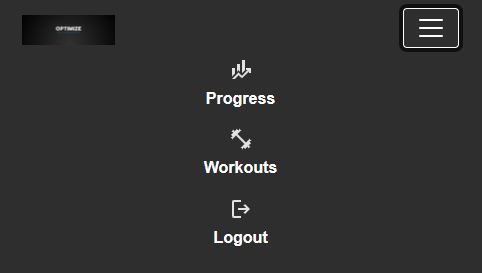

# Optimize

[Source code can be found here](https://github.com/CARRIXK/optimize)

[The live project can be viewed here](https://optimize-800f80d21807.herokuapp.com/)

Optimize is a web-based fitness app that allows users to create and edit workouts tailored to their needs. Users can build personalized workout routines by adding exercises and specifying sets with reps for each. Whether you're tracking strength progress, designing structured training plans, or simply organizing your workouts, Optimize provides a streamlined and intuitive interface to make workout planning effortless.

Features
--------

### Existing Features

- Navigation Bar

  - Featured on Progress, Workouts, login and register sections, the full responsive navigation bar includes links to the progress, Workouts and logout and login (when user in not logged in).  
  - This section will allow the user to easily navigate from through the main areas of the app

  

  

- Register

Users can easily create an account by filling out a simple registration form. During the sign-up process, they are required to provide:

- Username

- Email address

- Password

This information is securely handled and stored, allowing users to log in and access personalized features within the app. The registration process is user-friendly and ensures only authenticated users can track and manage their workouts.

- Login

Registered users can log in by entering their username and password on the login page. If a user hasn’t signed up yet, they can easily navigate to the registration page via a clearly visible link.

Features of the login page include:

- Username and password authentication

- Redirect link to registration if the user doesn't have an account

- Secure login using Django’s built-in authentication system

Once logged in, users are granted access to personalized sections of the app, such as workout tracking and progress metrics.

- Log out

Users can log out of their account by clicking the logout icon in the navigation bar. This action takes them to a confirmation page, where they are asked to confirm whether they want to end their session.

Key points:

- Logout is easily accessible from any page via the nav bar icon

- Users are shown a confirmation message before logging out

- Once confirmed, the user is securely logged out and notified they are no longer logged in with a link to the login page

This helps ensure users don’t accidentally log out and improves overall user experience and security.

- Progress

The Progress section is currently only populated with static dummy data. In future iterayions it will provide users with an overview of their workout activity and habits. It visually displays their performance over time and motivates them to stay consistent.

Key features:

- Workouts This Week (Bar Chart):
A visual graph showing which days (Monday to Sunday) the user has completed workouts. Helps highlight active vs. inactive days.

- Total Workouts:
Displays the cumulative number of workouts completed.

- Longest Streak:
Shows the highest number of consecutive days the user has logged workouts.

- Most Active Day:
Highlights the day of the week the user most frequently works out.

- Workout History:
Users can also click the calendar icon in the top-right to view a detailed log of their previous workouts, including dates and workout details.

This section helps users measure their consistency and identify patterns, supporting long-term fitness goals.

- Workouts Page

On the Workouts page, logged-in users can:

- View a list of workouts they have created.

- Click the plus button to start creating a new workout.

- Press the ⋯ (three dots) button on any workout to view available actions:

  - Start Workout

  - Edit

  - Delete

This page gives users full control over managing their custom workout plans.

- New Workout

1. After a user clicks the plus button on the Workouts page, they are taken to the page shown below. Here, the user is prompted to enter a title for the workout (e.g., "Push Day", "Cardio Routine").

2. After giving the workout a title, users are taken to the Add Exercises page.

- This page displays a scrollable list of exercises, each with a checkbox.

- Users can select multiple exercises to include in their workout.

- The "Add Exercises" button dynamically updates to show the number of exercises selected (e.g., “Add 3 Exercises”), helping users keep track of their selection in real time.

3. After selecting exercises, users are brought to a review page where they can:

- View all selected exercises in a clean, organized layout.

- Add sets and specify the number of reps for each exercise using input fields.

- Delete any exercise they no longer want included in the workout.

- Add more exercises at any time with the "Add Exercises" button which shows a similar display to the previous page.

Breaking the workout creation into three clear steps—naming the workout, selecting exercises from a scrollable list, and reviewing with options to add sets, reps, or modify exercises—provides a smooth and intuitive user experience. This approach prevents overwhelm, keeps the process organized, and allows users to easily build and customize workouts with confidence and efficiency.

- Edit workout

After clicking the "..." button on a workout, a modal appears presenting options including Start Workout, Edit, and Delete. Selecting the Edit button takes the user to a workout editor where they can easily manage their workout by adding new exercises, deleting existing ones, and adjusting the number of sets and reps for each exercise. This streamlined interface allows for quick and flexible customization of workouts.

- Delete Workout

Similarly, clicking the Delete button opens a confirmation modal asking the user to confirm the deletion of the workout. Once confirmed, the workout is permanently removed from the database, ensuring that accidental deletions are prevented while providing a clear and straightforward way to manage workout records.

- Footer

The footer section includes links to the relevant social media sites for Optimize. The links currently do not take the user anywhere as the social media sites have not been set up. The footer shows the business name and dynamically updates the current year automatically for accuracy.

**Features Left to Implement**

- Search excersise functionality

- Filter excersises by body part

- Make workout creation and update messages more user friendly instead of a message box

- Add actual images for each workout

- Start workout

The Start Workout feature will allow users to select a saved workout from the My Workouts section and actively log their progress in real time. Users will be able to:

  - View each exercise in the selected workout.

  - Record the number of sets, reps, and weight used for each exercise.

  - Track the total duration of the workout, which will automatically be recorded when the workout begins and ends.

This feature is designed to help users track performance over time and stay accountable by logging detailed workout data.

- Progress Tracking

Once a workout is completed, the results are automatically reflected in the Progress section of the app. This section provides users with a quick overview of their training habits and milestones through the following metrics:

- Workouts This Week – A bar chart showing workout activity across the current week (Monday to Sunday).

 - Total Workouts – Displays the cumulative number of completed workouts.

 - Longest Streak – Highlights the longest number of consecutive workout days.

 - Most Active Day – Indicates the day of the week the user is most consistently active.

Additionally, users can tap the calendar icon in the top-right corner to view their full workout history, including past workout sessions and performance logs.

# Testing

-----

**Manual Testing**

This section documents the manual testing procedures used to validate the functionality, usability, responsiveness, and data management of the Optimize fitness application. Testing was performed manually across all core pages using a browser and developer tools. The application uses HTML, CSS, JavaScript, and Python (Django). Each feature was tested based on defined expected outcomes.

You can find the detailed manual testing documentation here:  
[Optimize Manual Testing Documentation](manual_testing.docx)
                 |
---

## Responsivity Testing
In addition, you should mention in this section how your project looks and works on different browsers and screen sizes.

## Bugs
You should also mention in this section any interesting bugs or problems you discovered during your testing, even if you haven't addressed them yet.

If this section grows too long, you may want to split it off into a separate file and link to it from here.

**Validator Testing**

- HTML

Each page was run locally on a server and then the HTML from the page source was passed through the  [Official WC3 validator](https://validator.w3.org/#validate_by_input)

- [x] Login Page
- [x] Logout page
- [] Forgot password
- [x] Progress

- [] Workouts
- [x] New Workout
- [x] Add Excersises to new workout
- [x] Workout set reps
- [x] Edit Workout 

Errors found:

  - This is when a new workout is added to the 'My Workouts section'
  - Error: Attribute workout_id not allowed on element button at this point.
  - Error: Attribute workout_title not allowed on element button at this point.

- CSS
No errors were found when passing through the 
[Official W3C (Jigsaw) validator](https://jigsaw.w3.org/css-validator/#validate_by_input)

**Unfixed Bugs**
You will need to mention unfixed bugs and why they were not fixed. This section should include shortcomings of the frameworks or technologies used. Although time can be a big variable to consider, paucity of time and difficulty understanding implementation is not a valid reason to leave bugs unfixed.

- The forgot password functionality throws the following error: [WinError 10061] No connection could be made because the target machine actively refused it
- When adding excersises to new workout the app crashes. This could be down to improper assignment of workout id. 

## Summary of Testing Results

- All manual tests were conducted on both backend and frontend.
- Expected outcomes matched actual results.
- No major issues found.

# Deployment
-------

Git was initialized in the project folder using git init because the project was not tracked. A new Heroku app was created with heroku create, which added the Heroku remote to the Git repository. All project files were added to staging using git add -A and committed with the message “Initial commit for Heroku deployment.” The code was pushed to Heroku using git push heroku main. A Procfile was created in the project root to tell Heroku how to start the app. Dependencies were listed correctly in requirements.txt or package.json. Necessary environment variables were set through the Heroku dashboard. After pushing, Heroku built and deployed the app, which was accessed via the given URL. Optional steps include adding a database, logging, and CI/CD integration.

# Credits
--------
In this section you need to reference where you got your content, media and extra help from. It is common practice to use code from other repositories and tutorials, however, it is important to be very specific about these sources to avoid plagiarism.

You can break the credits section up into Content and Media, depending on what you have included in your project.

**Libraries and Programs Used**

* Heroku
* Heroku was used to deploy the project
* Git
* Version control was implemented using Git through the Github terminal.
* Github
* Github was used to store the projects after being pushed from Git and its cloud service Github Pages was used to serve the project on the web. GitHub Projects was used to track the User Stories.
* Visual Studio Code

**Content**

The text for the Home page was taken from Wikipedia Article A
Instructions on how to implement form validation on the Sign Up page was taken from Specific YouTube Tutorial
The icons in the footer were taken from Font Awesome
Media
The photos used on the home and sign up page are from This Open Source site
The images used for the gallery page were taken from this other open source site
Congratulations on completing your Readme, you have made another big stride in the direction of being a developer!

**Use of AI Tools to help with the development process**

During the development of this project, I strategically leveraged AI tools to assist in generating key portions of the codebase, such as form validation logic, UI component structuring, and dynamic event handling. This approach helped accelerate development while ensuring alignment with the project’s functional requirements. The AI-generated code was carefully reviewed and integrated to enhance maintainability and user experience, contributing to a more efficient and effective workflow. AI tools played a valuable role in identifying and resolving bugs throughout the development process. When encountering errors or unexpected behavior, I used AI assistance to quickly analyze code snippets, pinpoint issues such as event listener misconfigurations and null reference errors, and suggest effective solutions. This collaboration streamlined debugging, reducing downtime and improving code reliability.AI tools helped enhance both the performance and user experience of the application by recommending more efficient code patterns and UI improvements. Suggestions such as event delegation for dynamic elements and responsive design best practices were implemented, resulting in smoother interactions and faster load times without compromising usability. Integrating AI tools into the development process significantly improved efficiency by accelerating coding, debugging, and optimization tasks. AI’s assistance allowed more focus on design and user experience, reducing time spent on routine coding challenges and enabling faster iteration cycles. Overall, AI enhanced workflow fluidity and project outcomes without disrupting creative control.

# Need to write about Unit tests

Other General Project Advice
Below you will find a couple of extra tips that may be helpful when completing your project. Remember that each of these projects will become part of your final portfolio so it’s important to allow enough time to showcase your best work!

One of the most basic elements of keeping a healthy commit history is with the commit message. When getting started with your project, read through this article by Chris Beams on How to Write a Git Commit Message

Make sure to keep the messages in the imperative mood
When naming the files in your project directory, make sure to consider meaningful naming of files, point to specific names and sections of content.

For example, instead of naming an image used ‘image1.png’ consider naming it ‘landing_page_img.png’. This will ensure that there are clear file paths kept.
Do some extra research on good and bad coding practices, there are a handful of useful articles to read, consider reviewing the following list when getting started:

Writing Your Best Code
HTML & CSS Coding Best Practices
Google HTML/CSS Style Guide
Getting started with your Portfolio Projects can be daunting, planning your project can make it a lot easier to tackle, take small steps to reach the final outcome and enjoy the process!

# Links to content
---
## Links to content
- [Features](#features)
- [User Experience](#user-experience)
- [Design](#design)
- [Fonts](#fonts)
- [Colour](#colour)
- [Wireframes](#wireframes)
- [Development Process](#development-process)
  - [Project Planning](#project-planning)
  - [Inline JavaScript](#inline-javascript)
  - [Data Model](#data-model)
- [Testing](#testing)
  - [Manual Testing](#manual-testing)
  - [Feature Testing](#feature-testing)
  - [Responsiveness](#responsiveness)
  - [Browser Compatibility](#browser-compatibility)
  - [Lighthouse](#lighthouse)
  - [Code Validation](#code-validation)
  - [Python](#python)
  - [JavaScript](#javascript)
  - [HTML](#html)
  - [CSS](#css)
  - [User Stories](#user-stories)
  - [Automated Testing](#automated-testing)
  - [Django Testing](#django-testing)
  - [Selenium Testing](#selenium-testing)
  - [Bugs](#bugs)
- [Libraries and Programs Used](#libraries-and-programs-used)
- [Deployment](#deployment)
  - [Deploying the App on Heroku](#deploying-the-app-on-heroku)
  - [Making a Local Clone](#making-a-local-clone)
  - [Running the App in Your Local Environment](#running-the-app-in-your-local-environment)
- [Credits](#credits)
- [Acknowledgements](#acknowledgements)

# Features
* Dashboard : After logging in, users are directed to the Dashboard Page, which provides an overview of their most recent activities and workouts. The main purpose of this page is to give users quick access to their recent progress and a streamlined way to track their fitness journey.

* Workouts : The Workouts page is where users can view a list of all the workouts they have created, providing an organized way to manage their fitness routines. Each workout is displayed with its title, number of excersises in that workout and date it was created. Users can interact with any workout by pressing the options button next to it, which opens a modal offering several options: starting the workout, editing the workout, or deleting it. 

* Create Workout : Creating a workout on the platform is an easy, customizable process that allows users to design routines tailored to their goals. Users begin by providing a title for their workout, such as "Leg Day" or "Upper Body Strength," then select exercises from a pre-defined list, which includes various movements targeting different muscle groups. After selecting exercises, users add sets and reps for each, determining the number of sets and reps per set. Users can then review and adjust the exercises, sets, and reps before saving the workout to their profile for future use. This process empowers users to create highly personalized workouts, track their progress, and stay on top of their fitness goals.

* Edit Workout: Editing a workout allows users to customize and adjust their exercises to better suit their needs. After selecting a workout to edit, users can add or remove exercises from the workout by selecting exercises from the list or deleting unwanted ones. For each exercise, users can add sets, specifying the number of repetitions . Additionally, if a user adds a new exercise, they can immediately add sets to it, ensuring that the workout is tailored to their specific training goals. .

* Future Features: In the future, functionality for starting a workout will be added to allow users to track their progress during the workout. This feature will enable users to begin their workout session directly from the workouts page, marking the start of their training. Once a workout is started, the app will track the completion of each exercise and set, recording important data such as the number of reps performed, the weight lifted, and any other relevant metrics. This tracking will provide users with real-time feedback on their performance, helping them to monitor their progress and adjust their workout intensity as needed. Additionally, the app will save these workout sessions, allowing users to review past workouts, track improvements over time, and make informed decisions about their future training routines.

# User Experience
## Design

### Fonts

### Colour

### Wireframes

# Development Process

# Data Model

# Testing
* Manual testing
* Automated testing
* In-app testing
* User story testing
* Validator testing

## Manual Testing
**Feature Testing**

**Responsiveness**
Here's screenshots taken with the Chrome dev tools device toolbar, set to the iPhone 12 Pro. They are, in order, the Workouts page, Create workout page, Add excersises page, workout set reps page:

iphone12_homepage iphone12_editor iphone12_instrument iphone12_review surfacepro_loop_detail

Here's the same five pages on the Surface Pro 7:

And finally the same five pages on a desktop monitor (1920x1080): 

**Browser Compatibility**
| Feature                                      | Chrome | Firefox | Safari (mobile) |
|----------------------------------------------|--------|---------|-----------------|
| Audio playback upon first user interaction  |    |     |             |
| Fonts render correctly                       |    |     |             |
| All elements visible                         |    |     |             |
| Pages are responsive at all screen sizes     |   |     |             |

